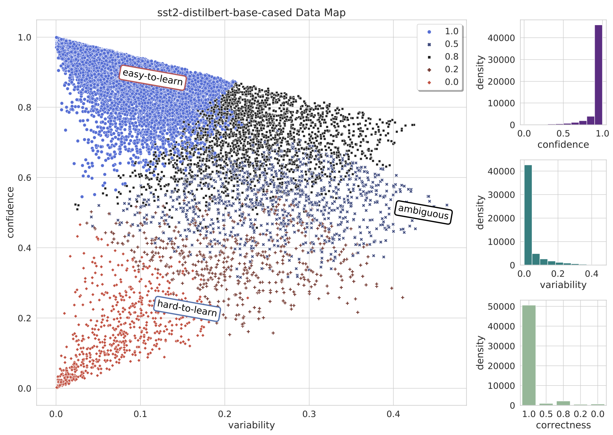

# TrainingDynamics

> This project is mainly inspired by [AllenAI's Dataset Cartography](https://github.com/allenai/cartography) project, where the model outputs (logits) of each sample is recorded after every training epoch. Based on these records, training dynamics (prediction confidence, variability, etc.) are computed to plot the Data Cartography to visualize the distribution of all training samples. However, the [original repo](https://github.com/allenai/cartography) hasn't been maintained for a long time. In this repo, we use the latest version of packages to reimplement the Dataset Cartography, as well as some other extensions based on the training dynamics.

## Basic requirements:
- transformers==4.18.0
- torch==1.7.0
- datasets==2.3.2
- accelerate==0.9.0
More requirements see `requirements.txt`.

## Usage:
For example, we want to record the training dynamics of SST2 dataset (a sentiment classification task from GLUE), we do the following steps:

1. Run `run_glue.sh` to obtain the training dynamics.
Specify the `TASK_NAME` (here we choose `sst2`), `MODEL` you want to use and num of epochs to train the classifier.
The following infomation will be recorded during training:
    - 'guid': the id of the sample
    - 'logits_epoch_{epoch}': output logits vector of the current sample  
    - 'gold': the true label (index)
After training, we can find the log files in `./dy_log/{TASK_NAME}/{MODEL}/training_dynamics` directory like:
```shell
dynamics_epoch_0.jsonl
dynamics_epoch_1.jsonl
dynamics_epoch_2.jsonl
...
```
each file contains records like:
```shell
{"guid": 50325, "logits_epoch_0": [2.943110942840576, -2.2836594581604004], "gold": 0, "device": "cuda:0"}
{"guid": 42123, "logits_epoch_0": [-2.7155513763427734, 3.249767541885376], "gold": 1, "device": "cuda:0"}
{"guid": 42936, "logits_epoch_0": [-1.1907235383987427, 2.1173453330993652], "gold": 1, "device": "cuda:0"}
...
```

2. Run `plot.sh` to plot the data cartography based the recorded training dynamics.
In `plot.sh`, we can specify the TASK_NAME and MODEL, which are used to determine the path of the training dynamics. First, the log files from each epoch are collected together, several metrics (confidence, variability, correctness, forgetfulness, etc.) are calculated and saved into a single file, named by 'td_metrics.jsonl' (in the save directory `./dy_log/{TASK}/{MODEL}/training_dynamics`):
```shell
{"guid":50325,"index":0,"threshold_closeness":0.0039580798,"confidence":0.9960261285,"variability":0.0012847629,"correctness":4,"forgetfulness":0}
{"guid":42123,"index":1,"threshold_closeness":0.0012448987,"confidence":0.9987535477,"variability":0.0007707975,"correctness":4,"forgetfulness":0}
{"guid":42936,"index":2,"threshold_closeness":0.0396512556,"confidence":0.958637923,"variability":0.0095242939,"correctness":4,"forgetfulness":0}
...
```

Then, a data map (dataset cartography) is plotted based on these metrics:

